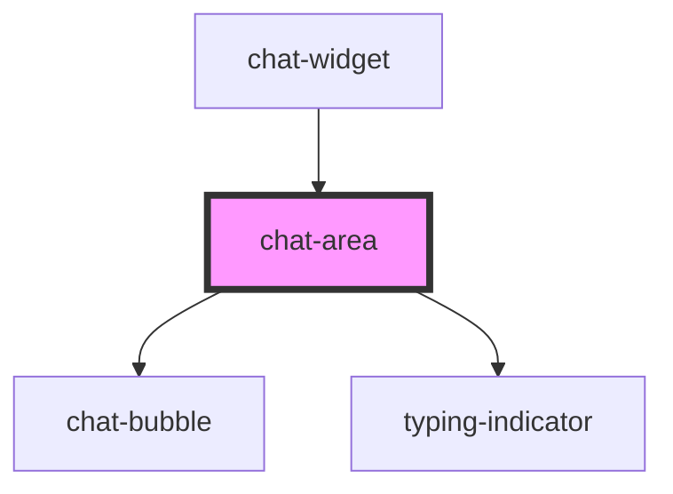

# chat-area

<!-- Auto Generated Below -->

## Properties

| Property | Attribute | Description | Type     | Default |
| -------- | --------- | ----------- | -------- | ------- |
| `agent`  | `agent`   |             | `string` | `''`    |

## Events

| Event                       | Description | Type                  |
| --------------------------- | ----------- | --------------------- |
| `requestSocketReconnection` |             | `CustomEvent<void>`   |
| `sentMessage`               |             | `CustomEvent<string>` |

## Dependencies

### Used by

 - [chat-widget](../chat-widget)

### Depends on

- [chat-bubble](../chat-bubble)
- [typing-indicator](../typing-indicator)

### Graph

----------------------------------------------

*Built with [StencilJS](https://stenciljs.com/)*
