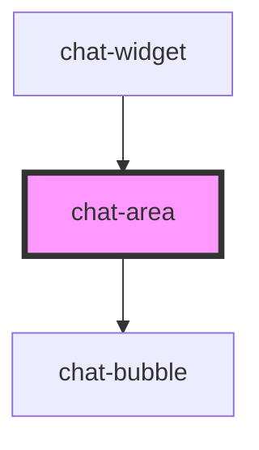

# chat-area

<!-- Auto Generated Below -->

## Properties

| Property            | Attribute             | Description | Type                                                               | Default     |
| ------------------- | --------------------- | ----------- | ------------------------------------------------------------------ | ----------- |
| `isBotTyping`       | `is-bot-typing`       |             | `boolean`                                                          | `false`     |
| `isSocketConnected` | `is-socket-connected` |             | `boolean`                                                          | `false`     |
| `messages`          | `messages`            |             | `{ type: "user" \| "bot"; message: string; timestamp: string; }[]` | `undefined` |

## Events

| Event          | Description | Type                  |
| -------------- | ----------- | --------------------- |
| `requestClose` |             | `CustomEvent<void>`   |
| `sentMessage`  |             | `CustomEvent<string>` |

## Dependencies

### Used by

 - [chat-widget](../chat-widget)

### Depends on

- [chat-bubble](../chat-bubble)

### Graph

----------------------------------------------

*Built with [StencilJS](https://stenciljs.com/)*
