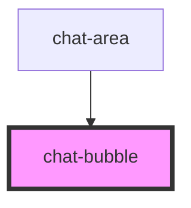

# chat-bubble

<!-- Auto Generated Below -->

## Properties

| Property  | Attribute | Description | Type              | Default |
| --------- | --------- | ----------- | ----------------- | ------- |
| `message` | `message` |             | `string`          | `''`    |
| `type`    | `type`    |             | `"bot" \| "user"` | `'bot'` |

## Dependencies

### Used by

 - [chat-area](../chat-area)

### Graph

----------------------------------------------

*Built with [StencilJS](https://stenciljs.com/)*
