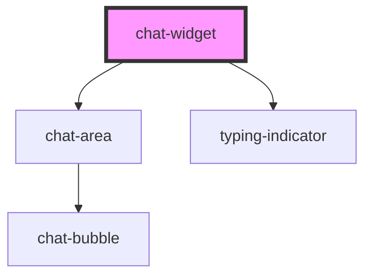

# chat-widget

<!-- Auto Generated Below -->

## Properties

| Property           | Attribute           | Description | Type     | Default     |
| ------------------ | ------------------- | ----------- | -------- | ----------- |
| `botName`          | `bot-name`          |             | `string` | `'Juno'`    |
| `buttonBackground` | `button-background` |             | `string` | `'#c9ff07'` |
| `socketURL`        | `socket-u-r-l`      |             | `string` | `''`        |

## Events

| Event                | Description | Type                   |
| -------------------- | ----------- | ---------------------- |
| `socketChangeStatus` |             | `CustomEvent<boolean>` |

## Dependencies

### Depends on

- [chat-area](../chat-area)
- [typing-indicator](../typing-indicator)

### Graph

----------------------------------------------

*Built with [StencilJS](https://stenciljs.com/)*
