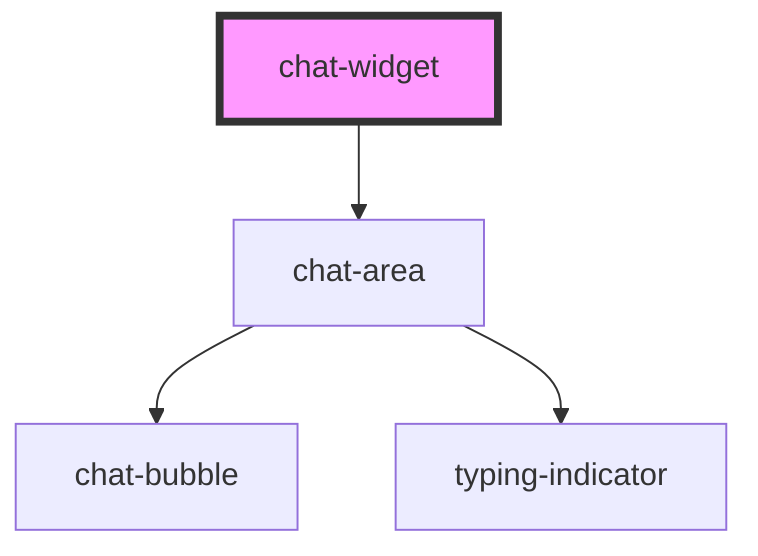

# chat-widget

<!-- Auto Generated Below -->

## Properties

| Property               | Attribute                | Description | Type     | Default                                                                                                         |
| ---------------------- | ------------------------ | ----------- | -------- | --------------------------------------------------------------------------------------------------------------- |
| `agent`                | `agent`                  |             | `string` | `'Juno'`                                                                                                        |
| `buttonBackground`     | `button-background`      |             | `string` | `'oklch(0.491 0.27 292.581)'`                                                                                   |
| `disclaimerText`       | `disclaimer-text`        |             | `string` | `"I'm an AI chatbot. While I aim for accuracy, my responses may not always be entirely correct or up-to-date."` |
| `maxReconnectAttempts` | `max-reconnect-attempts` |             | `number` | `5`                                                                                                             |
| `socketURL`            | `socket-u-r-l`           |             | `string` | `''`                                                                                                            |

## Dependencies

### Depends on

- [chat-area](../chat-area)

### Graph

----------------------------------------------

*Built with [StencilJS](https://stenciljs.com/)*
